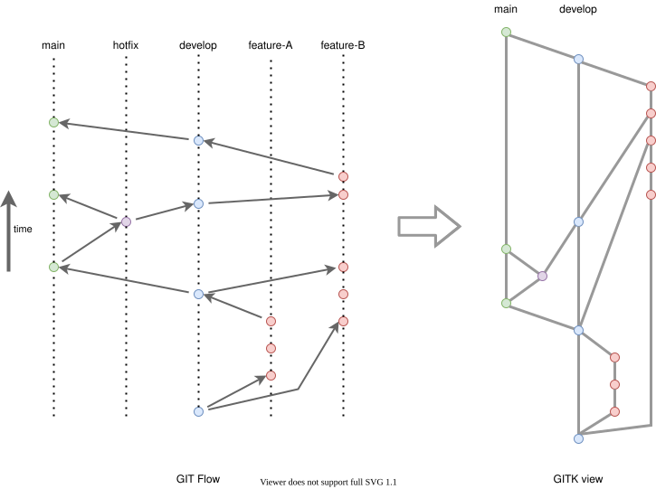
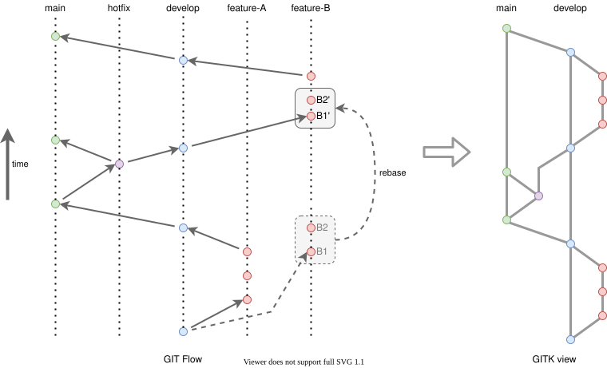
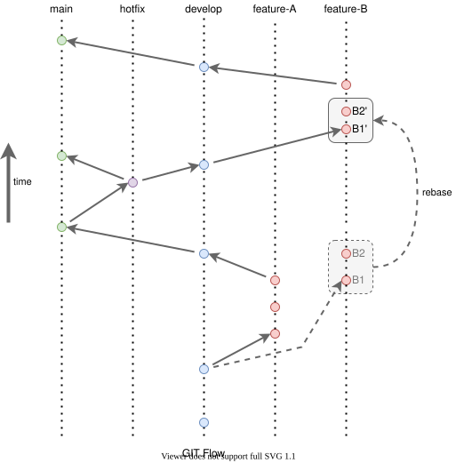

# Git Workflow

Definition of the swisstopo `git` workflow used in github repositories in order to keep the history as clean as possible.

- [Goal](#goal)
- [Branch Model](#branch-model)
  - [Personal branches naming convention](#personal-branches-naming-convention)
- [Long term development: `develop-DESCRIPTION`](#long-term-development-develop-description)
- [Pull Request Rules](#pull-request-rules)
  - [PR for Request For Comment (RFC)](#pr-for-request-for-comment-rfc)
  - [PR Work in Progress](#pr-work-in-progress)
- [Git Workflows](#git-workflows)
  - [Create Personal Branch](#create-personal-branch)
  - [Create PR](#create-pr)
  - [Modify a PR](#modify-a-pr)
  - [Close a PR](#close-a-pr)
- [New release](#new-release)
- [Merge Conflict](#merge-conflict)
  - [1. Conflict in a personal head branch](#1-conflict-in-a-personal-head-branch)
  - [2. Conflict in a shared head branch](#2-conflict-in-a-shared-head-branch)
    - [Merging `develop` into `main`](#merging-develop-into-main)
    - [Merging `main` into `develop`](#merging-main-into-develop)
    - [Merging `develop` into `develop-DESCRIPTION`](#merging-develop-into-develop-description)
- [GIT Configuration](#git-configuration)
- [Github repository Configuration](#github-repository-configuration)
- [References](#references)

## Goal

The goal of the following rules and workflow is to avoid such git history



Which can end up quite messy


But to have an history like this



Which is, when we avoid `hotfix`, much easier to read and understand.

## Branch Model

We follow the git flow as in the picture below:



This flow is an adaptation of the original [Git Flow](https://nvie.com/posts/a-successful-git-branching-model/) with some ideas from [Github Flow](http://scottchacon.com/2011/08/31/github-flow.html) and [Gitlab Flow](https://docs.gitlab.com/ee/topics/gitlab_flow.html).

The main branch is `main` and the branch for development is `develop`.

- Everything in `main` and `develop` branches has production quality
- Directly pushing to `main` and `develop` is forbidden and should be protected by github branch rule
- `main` and `develop` are **SHARED** branches
- `push --force` on shared branches is **FORBIDDEN**
- Code on `main` is automatically deployed on INT and upon request/approval on PROD
- Code on `develop` is automatically deployed on DEV
- New features and bug fixes are done on **PERSONAL** branches (see below for [naming conventions](#personal-branches-naming-convention)) and merged in `develop` branch via pull request after review and approval by another member of the team
- Personal branches are owned by the creator and only the owner is allowed to push to it ! This allows the use of `push --force` on those branches.
- Hot fixes should be avoided, if not avoidable it must be small changes and directly merged into `main`.

### Personal branches naming convention

The naming convention below is used by a GitHub Action to automate PR labeling.

| Branch | Description |
|--------|-------------|
| `data-JIRA-SUMMARY`, `data/JIRA/SUMMARY` | Personal branch to be merged by PR into `develop`. This branch SHOULD have a `JIRA` issue ID (i.e. `GPS-9999`) and optionally a very short title at the end. This branch contains data integration related work. |
| `feat-JIRA-SUMMARY`, `feature-JIRA-SUMMARY`, `feat/JIRA/SUMMARY`, `feature/JIRA/SUMMARY` | Personal branch to be merged by PR into `develop`. This branch SHOULD have a `JIRA` issue ID and optionally a very short title at the end. This branch contains non data integration related work that should be done for the next release. |
| `bug-JIRA-SUMMARY`, `bugfix-JIRA-SUMMARY`, `bug/JIRA/SUMMARY`, `bugfix/JIRA/SUMMARY` | Personal branch to be merged by PR into `develop`. This branch SHOULD have a `JIRA` issue ID and optionally a very short title at the end. This branch contains bugfix related work that should be done for the next release. |
| `hotfix-JIRA-SUMMARY`, `hotfix/JIRA/SUMMARY` | Personal branch to be merged by PR directly into `main` and will be deployed as hot fix. Note here the JIRA issue ID might be optional if there is no JIRA ticket related to the bug fix. |
| `chore-SUMMARY`, `chore/SUMMARY` | Personal branch for small maintenance work that is not associated with a JIRA ticket, to be merged by PR into `develop`. |

> [!NOTE]
> - **Prefix in branch names are important in order to set the correct PR label for release note categorization!**
> - **JIRA issue ID in branch is important in order to link the branch to the JIRA ticket !**
> - **Git commit should also have the JIRA issue ID in the title for the linking !**

## Long term development: `develop-DESCRIPTION`

In case of a long term development, we should avoid working weeks or even worse months long on a single PR
creating at the end a huge PR to review. Review of a huge PR is not efficient and often results in bad review quality
(missing important points). To avoid this and still keep the branch rules defined above (`main` and
`develop` branches have production and working quality codes), we can create a third shared branch:

```text
develop-DESCRIPTION
```

where `DESCRIPTION` is a meaningful short description that can be easily understood (for example `develop-refactor-drawing`, `develop-migration-frankfurt`).

This branch must then follow these rules:

- Must be created from `develop`
- `develop-DESCRIPTION` is a shared branch where several developers can work on it and **MUST** have a github branch rule set accordingly.
  - Directly pushing to `develop-DESCRIPTION` is forbidden and should be protected by github branch rule
  - All PRs to `develop-DESCRIPTION` must be peer reviewed before merging (protected by github rule)
- New features/bug fixes are done on **PERSONAL** branches (see below for [naming conventions](#personal-branches-naming-convention)) and merged into `develop-DESCRIPTION` via reviewed PRs.
- Personal branches are owned by the creator and only the owner is allowed to push to it ! This allows the use of `push --force` on those branches.
- PRs to `develop-DESCRIPTION` code might not be working and might make the unit tests fail, but still needs to have production/clean code.
- TODO in `develop-DESCRIPTION` PRs are allowed.
- All other PR rules defined below in [Pull Request Rules](#pull-request-rules) are still valid (except for the two points mentioned just above)
- `develop-DESCRIPTION` branch needs to be regularly updated from its upstream branch; create a PR to merge `develop` into `develop-DESCRIPTION`
- Once `develop-DESCRIPTION` has reached a fully working production state, it can be merged back into its upstream branch; create a PR to merge `develop-DESCRIPTION` into `develop` and once merged delete `develop-DESCRIPTION`

## Pull Request Rules

- Pull requests should only be created if the changes in the `feature|bugfix|hotfix` branch are **ready** to be discussed/reviewed/merged.
  - Exception to the rule above are:
    - PRs for RFC (see [PR for Request For Comment (RFC)](#pr-for-request-for-comment-rfc))
    - WIP PRs, those MUST be created as draft PRs
- A PR should be of **production** quality
- By default, the PR title and every commit title MUST reference the related JIRA ticket using the following format:

  ```text
  <JIRA-ISSUE-ID>: <SUMMARY>
  ```

  For example: `PB-9999: Added dataset validation`.
- As an exception, small changes that are not tracked by JIRA MAY use the [Conventional Commits](https://www.conventionalcommits.org/en/v1.0.0/) format for both PR and commit titles:

  ```text
  <type>(<optional-scope>): <summary>
  ```

  The supported types are `fix`, `chore`, `feat`, `docs`, and `revert`. Extensive work MUST be tracked by JIRA and use the default `<JIRA-ISSUE-ID>: <SUMMARY>` format.
- PR and commit titles should reflect the changes, be written in the past tense, and not exceed 100 characters. The PR title is used to generate the release notes.
- A PR description MUST NOT be empty.
- A PR is only assigned for review when it's **finished** and not WIP anymore, all commits must be **ready** for review (see below)
- A PR contains atomic and well named commits:
  - Each JIRA-related commit should use the following form:

    ```text
    <JIRA-ISSUE-ID>: <SUMMARY>

    Description of the issue being fixed by the commit. Eventually how the issue could be reproduced.

    Description of the solution to the issue that is being fixed.
    ```

  - if you have too many commits in your PR, **squash** them before assigning the PR for review
- A PR addresses a well described and well documented issue
- A PR describes the changes that are introduced and mentions possible side-effects for testing
- A PR describes the necessary steps to undertake before merging (infrastructure, data, varnish, etc.)
- A PR provides a test link - and if that's not possible describes how it can be tested
- PR must be **peer-reviewed** (unless changes are trivial). This applies to everything under version control (code, scripts, config, SQL,...). Try to review quickly if your review is requested.
- **EVERY Developer** is responsible for periodically checking his review requests (using email notification and/or the github [Pull Request page](https://github.com/pulls/review-requested)) and answering them ASAP, in order to not slow down development.
- PR must be merged with merge commits. This keeps the original commit hashes, adds a dedicated merge-commit and makes it easier to figure out which commits have been merged in which branches (no `fast forward` merge).
- **Avoid** changing commits after review (avoid _squash_, _split_ or _rewrite_), do new commit to apply the requested changes by the reviewer.
- PR must be **up to date** before merge, do a `git rebase` before merging.

    ```bash
    git fetch origin
    git rebase origin/develop # or origin/main
    git push --force origin PR_BRANCH
    ```

- **Don't use** the `Update Branch` Github button, use git CLI instead (see above).
  
  Alternatively you can use the `Update with rebase` Github button 
- Work is considered done, if a PR is **merged** (not when it's created)

### PR for Request For Comment (RFC)

PR can be used for starting a discussion as RFC. In this case the first rule can be ignored, but you need then to follow these ones:

- PRs for RFC must have `RFC` label and must be marked as `Draft`.

  

- Git commits don't require proper messages as the PR is in draft mode
- Once the RFC has ended, there are the following two possible flows:
  1. The PR is closed with a comment. Nothing gets merged!
  1. The PR is ready for review.
      - This implies first removing the `RFC` label
      - Then make sure that the PR follows the [Pull Request Rules](#pull-request-rules) above
      - Finally remove it from `Draft` mode by clicking on `Ready for Review` button

      

### PR Work in Progress

PR could be used to test the code on CodeBuild (usually only needed when setting up CodeBuild):

- PRs for WIP must have `WIP` label and must be marked as `Draft`.

  

- Git commits don't require proper messages as the PR is in draft mode
- Once the WIP has ended, there are the following two possible flows:
  1. The PR is closed with a comment. Nothing gets merged!
  1. The PR is ready for review.
      - This implies first removing the `WIP` label
      - Then make sure that the PR follows the [Pull Request Rules](#pull-request-rules) above
      - Finally remove it from `Draft` mode by clicking on `Ready for Review` button

      

## Git Workflows

This workflow refers to SemVer versioning.

### Create Personal Branch

1. Update the `develop` branch

    ```bash
    git checkout develop
    git pull  # git pull origin develop
    ```

1. Create and checkout your personal branch named according to the [convention](#personal-branches-naming-convention).

    ```bash
    git checkout -b PRIVATE_BRANCH # git branch PRIVATE_BRANCH; git checkout PRIVATE_BRANCH
    ```

1. Do your work and push it to the server

    ```bash
    git add .
    git commit -m "did something"
    git push origin PRIVATE_BRANCH # NEVER EVER DO `git push` always specify the destination `origin` and source
    ```

### Create PR

1. Update first your personal branch

    ```bash
    git checkout PRIVATE_BRANCH
    git fetch origin develop:develop # git fetch origin main:main
    git rebase origin/develop
    # or for main PR
    git rebase origin/main
    ```

1. Eventually re-organize, squash or rewrite your commits to have them production ready

    ```bash
    git rebase -i origin/develop
    # or
    git rebase -i origin/main

    # then push the new commits
    git push --force origin PERSONAL_BRANCH # force push on personal branch is allowed
    ```

1. Login into Github and navigate to the repo in order to create the PR (follow the [Pull Request Rules](#pull-request-rules) above)
1. Assign one or more reviewers

### Modify a PR

Once a PR has been created, some modification might be requested by peers (reviewer).

1. Create new commits and push them back to your personal branch (PR branch)
1. Eventually update the PR branch with `git rebase origin/develop|origin/main`
1. Re-request a review of your changes

### Close a PR

Once a PR has been approved do as follows

1. Make sure that the PR is up to date

    ```bash
    git fetch origin develop:develop
    git rebase -i origin/develop
    # or
    git rebase -i origin/main

    # then push the new commits
    git push --force origin PRIVATE_BRANCH
    ```

1. Then merge the PR to `develop` or `main`. This should be done from Github and not from the CLI

1. Finally do some clean up actions: delete your local PR branch as well as the remote PR branch (if not automatically done)

    ```bash
    git branch -d PRIVATE_BRANCH
    ```

## New release

See [Versioning and Release](./VERSIONING_RELEASE.md)

## Merge Conflict

When trying to merge a PR, conflicts might occur. There are 2 types of conflicts that need to be dealt with differently.

### 1. Conflict in a personal head branch

When merging a personal branch into a shared branch (e.g. `feat-my-feature` into `develop`), we should
never have conflicts as the head branch should always be rebased on top of the base branch. Due to this,
conflicts always happen during the rebase and need to be fixed during the rebase step on the personal branch.

### 2. Conflict in a shared head branch

When merging two shared branches, conflicts might occur and we can't directly fix them on a shared
branch as we have a PR policy.

#### Merging `develop` into `main`

In this case we should never have any conflict because we should always keep `develop` up to date by
merging `main` into `develop` (this is only needed when hotfixes have been merged into `main`).

#### Merging `main` into `develop`

When hotfixes have been merged into `main` they need to be added as well on the `develop` branch.
For this we create a PR to merge `main` into `develop`.

> [!WARNING]
> Only admin user can merge those PR as due to the branch protection of develop, the PR will
> be block due to the `This branch is out-of-date with the base branch` warning. Due to the nature of
> our git flow `main` branch can be out of date based on `develop` and in this special use case admins
> are allowed to bypass the branch protection. See [github.com/orgs/swissgeo/teams/swissgeo-admin](https://github.com/orgs/swissgeo/teams/swissgeo-admin)
> to see who is currently admin.

In this case conflicts might occur ! To solve them proceed as follows:

1. First open a PR to merge `main` into `develop`
2. Then if the PR can't be merged due to conflict, checkout both branches locally (make sure that both branches are up to date with their origin)

    ```bash
    git checkout main
    git pull
    git checkout develop
    git pull
    ```

3. Then manually merge `main` into `develop`

    ```bash
    git merge main
    ```

4. Solve the merge conflict using the merge tool (at best with Beyond Compare)

    ```bash
    git mergetool
    ```

5. Once all conflicts have been resolved, commit the merge conflict changes, it is a best practice to put
the files that had conflicts in the merge commit message. For this simply uncomment the conflicts line in the
automatic commit message.

    ```bash
    git commit
    ```

6. Finally, push the merge. Before this make sure that the PR opened in step 1 has been approved, otherwise you won't be able to merge !

    ```bash
    git push origin develop
    ```

#### Merging `develop` into `develop-DESCRIPTION`

Follow the same steps as in [Merging `main` into `develop`](#merging-main-into-develop)

## GIT Configuration

In order to have a proper git history, each developer MUST HAVE the following git configuration

```bash
$ git config --global --list
...
user.name=<developer-full-name>
user.email=<developer-email>
merge.ff=false
pull.rebase=true
...
```

To edit the config do:

```bash
git config --global --add user.name <full-name>
git config --global --add user.email <email>
git config --global --add merge.ff false
git config --global --add pull.rebase true
# or
$ git config --global --edit
...
[user]
  name = <full-name>
  email = <email>
[merge]
  ff = false
...
```

This ensures that a commit has a proper author and that the default behavior for merge is a non-fast-forward merge.

## Github repository Configuration

- Each github repo MUST BE configured to enforce PR review.
- Each github repo MUST DISALLOW the PR Merge if the PR is **not up to date**.
- Each github repo configuration MUST BE managed by Terraform, see [swissgeo/infra-terraform](https://github.com/swissgeo/infra-terraform)

## References

Here below are the reference list for the flow:

- [“A successful Git branching model” by Vincent Driessen](https://nvie.com/posts/a-successful-git-branching-model/)
- [“GitHub Flow” by Scott Chacon](http://scottchacon.com/2011/08/31/github-flow.html)
- [“Introduction to GitLab Flow” by GitLab](https://docs.gitlab.com/ee/topics/gitlab_flow.html)
- [“GitFlow considered harmful” by Adam Ruka](http://endoflineblog.com/gitflow-considered-harmful)
- [“OneFlow — a Git branching model and workflow” by Adam Ruka](http://endoflineblog.com/oneflow-a-git-branching-model-and-workflow)
